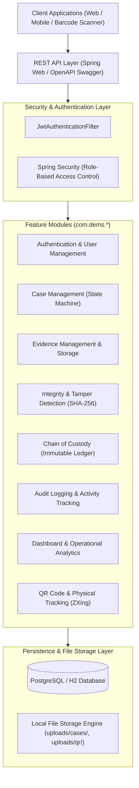
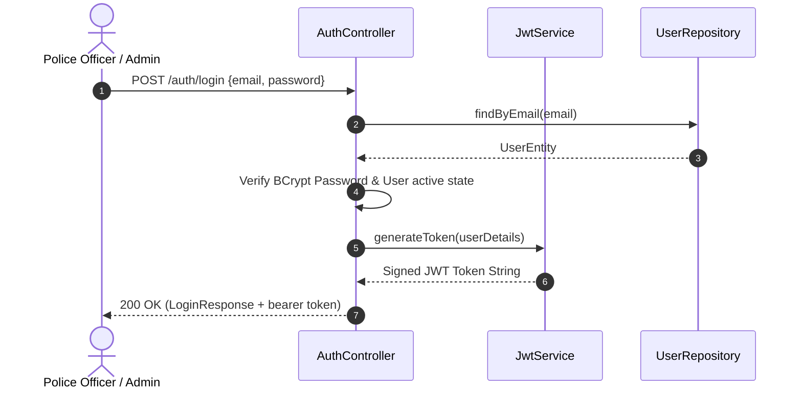
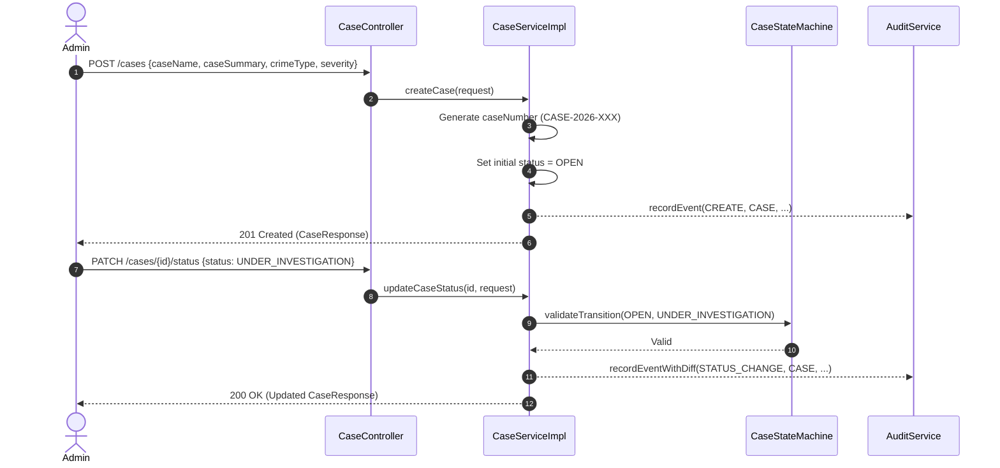
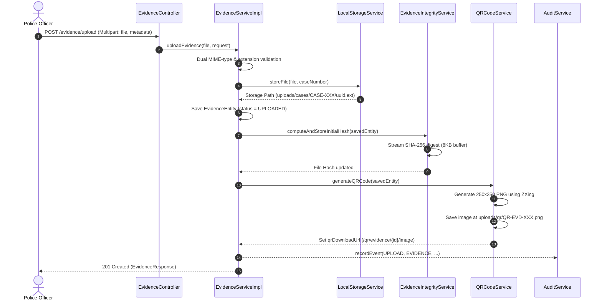
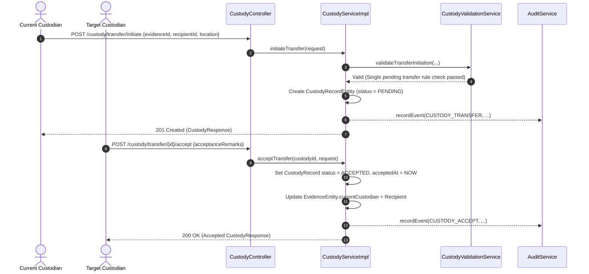
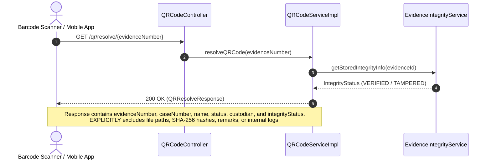

# Digital Evidence Management System (DEMS) - Architecture & System Blueprint

## Executive Overview

The **Digital Evidence Management System (DEMS)** is an enterprise-grade, legally auditable, Spring Boot 3 web application designed for law enforcement agencies, forensic labs, and judicial bodies to securely store, track, verify, and monitor digital and physical evidence throughout its complete lifecycle.

---

## 1. High-Level Technology Stack & Architecture

### Key Technical Specs
- **Runtime & Language**: Java 21 LTS
- **Framework**: Spring Boot 3.3.5
- **Security Engine**: Spring Security + JJWT (`0.12.6`) Stateless Token Authentication
- **Data Access**: Spring Data JPA & Hibernate ORM
- **Database Engine**: PostgreSQL (Production) / H2 (Isolated Test Environment)
- **Barcode Generator**: ZXing (`3.5.3`) Core & JavaSE
- **Architecture Pattern**: Feature-oriented modular architecture (`com.dems.<feature>`) with explicit Layered Separation (Controller → Service → Repository/Storage → Database/Disk).

---

## 2. System Components & Module Breakdown

| Feature Module | Package | Key Entities / Components | Core Responsibilities |
| :--- | :--- | :--- | :--- |
| **Authentication & User Management** | `com.dems.auth` `com.dems.user` | `UserEntity`, `JwtService`, `UserServiceImpl`, `DataInitializer` | User creation, role assignment (`ADMIN`, `POLICE_OFFICER`, `FORENSIC_EXPERT`, `COURT_OFFICIAL`), JWT issuance, auto-seeding admin account. |
| **Case Management** | `com.dems.cases` | `CaseEntity`, `CaseStateMachine`, `CaseServiceImpl` | Lifecycle state transitions (`OPEN` → `UNDER_INVESTIGATION` → `CLOSED` → `ARCHIVED`), officer assignment, dynamic specification searching. |
| **Evidence Management & Storage** | `com.dems.evidence` `com.dems.storage` | `EvidenceEntity`, `LocalStorageServiceImpl`, `EvidenceValidationService` | Dual MIME & extension validation, file upload to `uploads/cases/{caseNumber}/`, download streaming, evidence retrieval. |
| **Integrity & Tamper Detection** | `com.dems.integrity` | `Sha256HashService`, `EvidenceVerificationHistoryEntity`, `EvidenceIntegrityServiceImpl` | 8KB streaming buffer SHA-256 hash generation, live integrity verification against stored hashes, forensic history logging. |
| **Chain of Custody** | `com.dems.custody` | `CustodyRecordEntity`, `CustodyValidationService`, `CustodyServiceImpl` | Legally auditable immutable custody transfers (`PENDING` → `ACCEPTED` / `REJECTED`), single pending transfer enforcement, sequence tracking. |
| **Audit Logging** | `com.dems.audit` | `AuditLogEntity`, `AuditContextHolder`, `AuditServiceImpl`, `GlobalExceptionHandler` | Permanent immutable audit logging for all business actions and unexpected failures (IP, User-Agent, Correlation ID, time, diffs). |
| **Dashboard & Analytics** | `com.dems.dashboard` | `DashboardServiceImpl`, `DashboardController` | Executive summaries, module KPI breakdowns, between-date trend aggregations, top active users, system health monitoring. |
| **QR Code Tracking** | `com.dems.qr` | `QRCodeServiceImpl`, `QRCodeController` | Generates 250x250 PNG QR images stored under `uploads/qr/`, streams PNG images, ADMIN regeneration, non-sensitive barcode resolution. |

---

## 3. End-to-End API Workflows

### Workflow 1: User Login & Session Bootstrap

---

### Workflow 2: Case Creation & State Lifecycle

---

### Workflow 3: Evidence Upload, Hashing, & Auto-QR Generation

---

### Workflow 4: Chain of Custody Handshake Transfer

---

### Workflow 5: Physical Evidence Barcode Scanning & Verification

---

## 4. Complete REST API Endpoint Directory

### Authentication (`/auth`)
- `POST /auth/login`: Authenticate user credentials and receive JWT bearer token.

### User Management (`/users`)
- `POST /users`: Create new system user (ADMIN only).
- `GET /users`: List users with pagination and search filters.
- `GET /users/{id}`: Retrieve specific user profile.
- `PUT /users/{id}`: Update user profile details.
- `PATCH /users/{id}/status`: Activate or disable user account (ADMIN only).

### Case Management (`/cases`)
- `POST /cases`: Create new investigation case (ADMIN only).
- `GET /cases`: Search & list cases (by status, crime type, severity, case number).
- `GET /cases/my-cases`: List cases assigned to the logged-in officer.
- `GET /cases/{id}`: Get complete case details.
- `PUT /cases/{id}`: Update case summary and location details.
- `PATCH /cases/{id}/status`: Update case state via `CaseStateMachine`.
- `PATCH /cases/{id}/assign-officer`: Assign primary investigating officer (ADMIN only).

### Evidence Management (`/evidence`)
- `POST /evidence/upload`: Upload digital evidence file & metadata (Multipart).
- `GET /evidence`: Search evidence records with dynamic filter specifications.
- `GET /evidence/{id}`: Retrieve evidence metadata by ID.
- `GET /evidence/case/{caseId}`: List all evidence attached to a specific case.
- `GET /evidence/{id}/download`: Download raw evidence digital file.
- `PUT /evidence/{id}`: Update evidence metadata.
- `PATCH /evidence/{id}/status`: Transition evidence status (`UPLOADED` → `IN_LAB` → `COURT` → `ARCHIVED`).

### Evidence Integrity & Tamper Detection (`/integrity`)
- `POST /integrity/verify/{evidenceId}`: Live SHA-256 verification against stored hash.
- `GET /integrity/history/{evidenceId}`: Retrieve complete forensic verification history.
- `GET /integrity/dashboard`: Retrieve operational integrity statistics report.

### Chain of Custody (`/custody`)
- `POST /custody/transfer/initiate`: Initiate a custody transfer.
- `POST /custody/transfer/{id}/accept`: Accept a pending custody transfer.
- `POST /custody/transfer/{id}/reject`: Reject a pending custody transfer.
- `GET /custody/evidence/{evidenceId}`: Get complete immutable custody timeline for an evidence item.
- `GET /custody/my-pending-transfers`: Get pending custody requests for current user.

### Audit Logging (`/audit`)
- `GET /audit`: Query immutable audit logs with multi-field search specifications.
- `GET /audit/dashboard`: Operational audit action summary.

### Dashboard & Analytics (`/dashboard`)
- `GET /dashboard/summary`: High-level executive KPI summary.
- `GET /dashboard/cases`: Case status, crime type, and monthly creation analytics.
- `GET /dashboard/evidence`: Evidence file types, largest files, and monthly trends.
- `GET /dashboard/integrity`: Verification ratios and latest verifications feed.
- `GET /dashboard/custody`: Transfer status ratios and average transfer duration.
- `GET /dashboard/audit`: Event breakdowns by module and top active users.
- `GET /dashboard/recent-activities`: Real-time cross-module activity stream.
- `GET /dashboard/system-health`: Operational storage footprint, database status, and active user metrics.

### QR Code & Barcode Tracking (`/qr`)
- `GET /qr/evidence/{evidenceId}`: Retrieve QR code metadata & `qrDownloadUrl`.
- `GET /qr/evidence/{evidenceId}/image`: Stream 250x250 PNG QR code image (`image/png`).
- `POST /qr/evidence/{evidenceId}/regenerate`: Regenerate QR code PNG image (ADMIN only).
- `GET /qr/resolve/{evidenceNumber}`: Resolve barcode scan to safe, non-sensitive evidence metadata.
